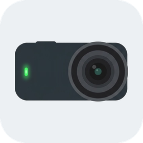

<p align="center">
  
</p>

<h1 align="center">OsmoNano</h1>

<p align="center">
  <a href="LICENSE"></a>
  <a href="https://apps.garmin.com/apps/67b74d57-fa8e-4da5-a073-7beffff693c6"></a>
  <a href="https://www.buymeacoffee.com/gnzlt"></a>
</p>

OsmoNano is a Garmin Connect IQ watch app that talks to the DJI Osmo Nano camera directly over the watch's own Bluetooth. You can start and stop recording, take a photo, and change the shooting mode. The watch shows whether the camera is connected and recording, and for how long.

## What it does

| Button | Action |
|---|---|
| **START** | Record or stop; in Photo mode, take a photo |
| **UP / DOWN** | Previous / next shooting mode: Video, Photo, Timelapse, Hyperlapse, SuperNight, Slow-mo |
| **Hold UP** | Menu: mode list, Disconnect / Reconnect, Change camera, Protocol, Diagnostics, About |
| **BACK** | Leave the app |

The screen shows each fact once:
- **The link:** a blue dot and "Connected", with four bars for how well the link carries.
- **The mode:** its name and glyph. While recording, it shows REC and the elapsed time instead.
- **What START will do:** a red mark on the bezel by the button. A dot means record or photo, a
  square means stop.
- **UP and DOWN:** grey arrows when the buttons change something.

Touches are ignored, so a stray tap can't fire the camera. While the camera records, the mode is
locked: changing it mid-recording makes the Nano show an error.

## Supported watches

OsmoNano supports Garmin's 5-button round watches with Bluetooth for apps, Connect IQ 5.0 or later,
and 768 KB for a watch app:
- fēnix 7, 8, 9 and E, and epix (Gen 2) / epix Pro;
- Enduro 3;
- Forerunner 165, 255 Music, 265, 570, 955, 965 and 970;
- MARQ (Gen 2);
- D2 Mach;
- Instinct 3 AMOLED.

That's 44 products in all. Quatix, tactix and other editions share these products.
[`scripts/devices.py`](scripts/devices.py) checks each candidate against Garmin's device profiles
and writes the list into `manifest.xml`. Touch-first watches (Venu, vivoactive) and monochrome
screens are out of scope.

**Status:** field-tested with an Osmo Nano on a fēnix 8 47 mm (mode, record, stop, photo). Every
other product builds and runs in the simulator, but hasn't met a camera yet. Reports from other
watches are very welcome.

## Install

- **Connect IQ Store:** coming soon.
- **Sideload:**
  1. Build (see below), or take a `.prg` from a release.
  2. Connect the watch by USB. On a Mac, use [OpenMTP](https://openmtp.ganeshrvel.com/).
  3. Copy `bin/OsmoNano-<product>.prg` to `GARMIN/APPS/`.
  4. **Optional, for a log file:** create an empty `GARMIN/APPS/LOGS/OSMONANO.TXT`. A sideloaded app
     writes its log there only if the file exists.

## First connection

1. Close or disconnect the camera's phone app: the camera takes one Bluetooth controller at a time.
2. **Put the Nano in its Vision Dock for the first pairing:** the camera has no screen, so the
   Approve prompt shows on the dock.
3. Open OsmoNano. The first time, it lists the devices it can see, likely Nanos first. Pick the
   camera with UP / DOWN and START.
4. Approve the watch on the dock. From then on the app remembers the camera and connects by itself.
   **Change camera** in the menu picks another one.

**Disconnect** (in the menu) drops the link so the camera can go to sleep. START reconnects.

## How it works

The Nano speaks DJI's **DUML** frame protocol over a BLE GATT service (`FFF0`: notify `FFF4`,
write `FFF5`). Connect IQ caps BLE at 20 bytes per write and per notification. Most control frames
are 13–18 bytes and fit in one write. Longer ones are split into chunks, and the camera's longer
frames arrive cut short: the app reads only fields whose bytes arrived and never guesses the rest.

```
source/duml/     Crc, Frame (build, parse, reassemble), Nano (commands and decoders)
source/camera/   NanoSession (the session: pairing, keepalive, status, buttons) over a Transport
source/ble/      BleLink: scan, pair, GATT setup, paced 20-byte writes, notifications
source/ui/       MainView (the one screen), MainDelegate (buttons), Menus, LogView
demo/            DemoCamera: a fake camera that walks every screen, for the simulator
test/            Unit tests: frames against reference vectors, the session against a fake transport
```

`Camera` is the seam between the UI and whatever talks to the camera. The rules the camera enforces
are listed in [`AGENTS.md`](AGENTS.md), and breaking one fails on the camera, not in the compiler:
- one GATT operation in flight;
- frames at least 120 ms apart;
- answer every camera request;
- a keepalive every second.

### Debugging on the watch

- **Diagnostics** (in the menu) shows the frame log live: orange is sent, green is received.
- **The log file** (`OSMONANO.TXT`, sideloaded builds only) has every line, with the version and
  the time.
- **Protocol** (in the menu) holds the session choices that may differ between firmware versions.
  They are the pairing frame's size, how to answer requests that arrived cut short, and a gap
  between chunks. Each select steps a choice; Reconnect applies it.

Logs hold the camera's Bluetooth address and serial. Remove them before sharing a log.

## Build and test

You need the [Connect IQ SDK](https://developer.garmin.com/connect-iq/sdk/) 9.2 or later, with the
device profiles downloaded in the SDK Manager, and a
[developer key](https://developer.garmin.com/connect-iq/connect-iq-basics/getting-started/). The
build looks for the key at `~/.config/connectiq/developer_key.der`, or at `$CIQ_KEY`.

```sh
scripts/build.sh            # bin/OsmoNano-<product>.prg for every product, and the test build
DEVICE=fenix847mm scripts/build.sh --demo   # one product, plus the demo build
scripts/build.sh --iq       # also the Store packages: bin/OsmoNano.iq and bin/OsmoNano-beta.iq
scripts/test.sh             # every unit test, in the SDK simulator
uv run --no-project python scripts/devices.py   # which candidate watches ship, and why the others don't
scripts/icons.sh            # regenerate the launcher icons, the mode art and the Store images (needs uv, and rsvg-convert or resvg)
```

The build uses strict type checking (`-l 3`), and **any compiler warning fails it**. To see every
screen without a camera, run the demo build in the simulator, which has no Bluetooth:
`connectiq`, then `monkeydo bin/OsmoNano-demo.prg fenix847mm`. It loops every 60 seconds.

## Contributing

Issues and pull requests are welcome: bug reports, results from watches and firmware versions
not tested yet, and fixes. Before a pull request:
1. `scripts/build.sh` compiles with no warnings.
2. `scripts/test.sh` passes.
3. After a UI change, look at every screen in the demo build, on a large and a small screen.

The code style (explicit types everywhere, comments that say *why*) and the hard rules are in
[`AGENTS.md`](AGENTS.md). The one that matters most: **never send a shooting-mode value outside
`Nano.MODES`.** Unknown values have frozen a Nano.

## Credits

The protocol details come from these open-source projects, all MIT-licensed:
- [KonradIT/DJI-ESP32-Remote](https://github.com/KonradIT/DJI-ESP32-Remote) and
  [KonradIT/osmosis](https://github.com/KonradIT/osmosis);
- [dstrat28/action-multicam-remote](https://github.com/dstrat28/action-multicam-remote).

See [`THIRD_PARTY_NOTICES.md`](THIRD_PARTY_NOTICES.md).

## License

[MIT](LICENSE). DJI, Osmo and Osmo Nano are trademarks of SZ DJI Technology Co., Ltd. Garmin,
fēnix and Connect IQ are trademarks of Garmin Ltd. This project is independent, and not affiliated
with or endorsed by DJI or Garmin.
